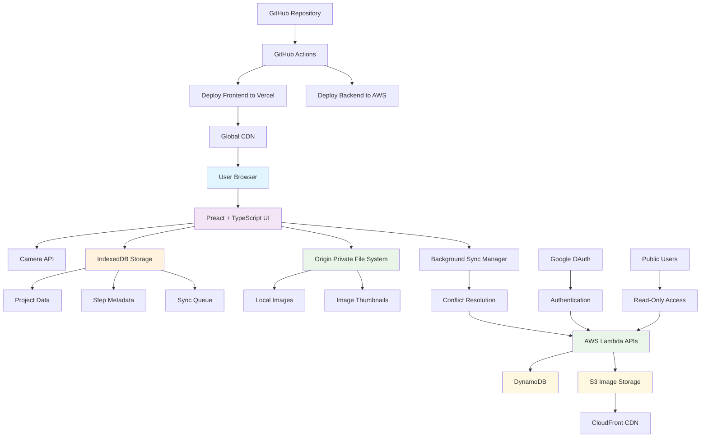

# Miniature Workshop

## Description
Miniature Workshop is a comprehensive tool designed for Warhammer and tabletop miniature painters to document, track, and share their painting processes. The app allows painters to capture their techniques step-by-step with photos and detailed notes, creating a personal reference library and enabling knowledge sharing within the miniature painting community.

## Features
- **Photo Documentation**: Capture high-quality images of your miniatures at each stage of the painting process
- **Step-by-Step Notes**: Record detailed painting techniques, color recipes, and tips for each step
- **Personal Paint Library**: Build your own reference collection of completed projects and techniques
- **Community Sharing**: Share your painting guides and techniques with other miniature painters
- **Progress Tracking**: Monitor your painting journey and see how your skills develop over time
- **Search & Filter**: Easily find specific techniques, colors, or projects in your collection

## Getting Started

### Prerequisites
- Node.js (version 18 or higher)
- npm or yarn package manager
- Modern web browser with camera support (for photo capture)
- AWS CLI configured (for backend deployment)
- Serverless Framework CLI (`npm install -g serverless`)
- Google Cloud Console project (for OAuth setup)
- Vercel CLI (optional, for local testing)

### Installation
```bash
# Clone the repository
git clone https://github.com/yourusername/miniature-workshop.git

# Navigate to project directory
cd miniature-workshop

# Install dependencies
npm install

# Start the development server
npm run dev
```

## Domain Terminology
- **Miniature/Mini/Model**: A plastic, metal or resin figurine that is built and painted
- **Unit**: A set of 1 or more Models that are used as a group (Warhammer term)
- **Painting Technique**: Methods like base coating, layering, drybrushing, or airbrushing
- **Paint Mix**: Custom blend of paints, water, and mediums with specific ratios

## Core Workflows

### Unit-Based Project Organization
Projects are organized by **Units** since models within a unit typically share the same painting style and approach.

### Flexible Painting Approaches
The app supports different painting workflows without forcing a specific pattern:

**Model-by-Model Approach:**
- Paint one complete model from start to finish
- Document the entire process for that single model
- Repeat for each model in the unit

**Batch Painting Approach:**
- Apply the same painting step across all models in the unit
- Document each step with photos of multiple models
- Progress through techniques systematically

**Hybrid Approaches:**
- Mix and match techniques as preferred
- Document whatever works best for your style

### Detailed Step Tracking
Each painting step captures comprehensive information for future reference:

**Technique Documentation:**
- Specific painting techniques used (base coating, layering, drybrushing, etc.)
- Step-by-step order and sequence

**Paint Information:**
- Paint brands and color names
- Custom paint mixes with precise ratios
- Water and medium additions (thinning ratios, texture mediums, etc.)
- Mix consistency and application notes

**Tools & Equipment:**
- Brush types and sizes used
- Airbrush settings and nozzle sizes
- Other tools (sponges, cotton swabs, etc.)

**Visual Documentation:**
- Progress photos at each step
- Detail shots of specific techniques
- Full model and unit overview images
- Before/after comparisons

## Usage
1. **Create a Unit Project**: Start documenting a new unit you're painting
2. **Choose Your Approach**: Document model-by-model or step-by-step across the unit
3. **Add Progress Photos**: Capture images at each stage with detailed notes
4. **Record Techniques**: Include paint colors, brush types, and specific techniques used
5. **Save & Organize**: Projects are automatically saved and organized by unit type
6. **Share Knowledge**: Export your painting guides to help other painters

## Technical Architecture

### Overview
Miniature Workshop is built as a Progressive Web App (PWA) with offline-first capabilities, ensuring seamless use across mobile and desktop devices.

### Frontend Stack
- **Language**: TypeScript for type safety and better development experience
- **Framework**: Preact for lightweight, React-compatible components
- **Styling**: Tailwind CSS for utility-first responsive design
- **PWA Features**: Service workers for offline functionality and app-like experience
- **Camera Integration**: Native browser camera API for photo capture

### Data Storage Strategy
- **Primary Storage**: Browser's IndexedDB for immediate data persistence
- **Image Storage**: Origin Private File System (OPFS) for optimized local image storage
- **Offline-First**: All data (projects, steps, images) stored locally on creation
- **Background Sync**: Asynchronous synchronization to backend when online
- **Conflict Resolution**: Smart merging for data conflicts during sync

### Backend Stack (AWS)
- **Language**: TypeScript with Node.js runtime
- **API**: AWS Lambda functions for serverless REST API
- **Database**: Amazon DynamoDB for structured data storage
- **Image Storage**: Amazon S3 for optimized image storage and delivery
- **Authentication**: Google OAuth integration for user login
- **Infrastructure**: Serverless Framework for AWS resource management

### Deployment & CI/CD
- **Frontend Hosting**: Vercel for optimized static site deployment
- **Backend Deployment**: Serverless Framework with AWS Lambda
- **CI/CD Pipeline**: GitHub Actions for automated deployments
- **Trigger**: Automatic deployment on main branch updates
- **Environment Management**: Separate staging and production environments

### Data Access Model
- **Public Reading**: All painting guides and projects are publicly viewable
- **Authenticated Writing**: Users must log in with Google to create/edit content
- **Open Knowledge Sharing**: Promotes community learning and technique sharing

### Key Benefits
- **Instant Response**: No waiting for network requests during creation
- **Offline Capable**: Full functionality without internet connection
- **Cross-Device Sync**: Access your projects from any device
- **Reliable**: Data never lost due to network issues

## Architecture Diagram



## Contributing
Instructions for contributing to this project will be added here.

## License
[License information to be added] 